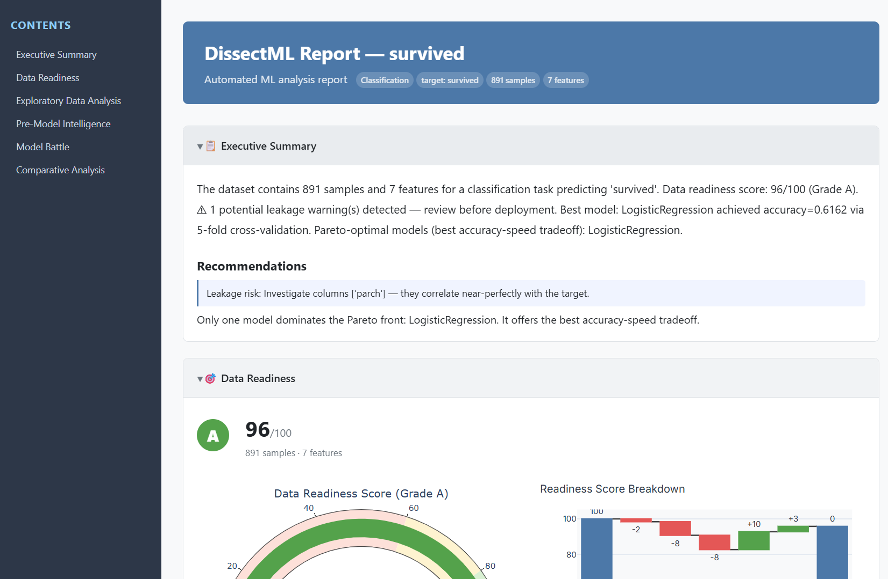

<div align="center">

# DissectML

[](https://pypi.org/project/dissectml/)
[](https://github.com/rupeshbharambe24/dissectML)
[](https://github.com/rupeshbharambe24/dissectML/actions/workflows/ci.yml)
[](https://github.com/rupeshbharambe24/dissectML/blob/master/LICENSE)
[](https://colab.research.google.com/github/rupeshbharambe24/dissectML/blob/master/notebooks/dissectml_demo.ipynb)

**The missing middle layer between EDA and AutoML.**

*Deep data understanding meets model comparison -- the full journey from
"What is my data?" to "Which model is best and WHY?", in as few as 3 function calls.*

[Quick Start](#quick-start) | [Features](#key-features) | [Installation](#installation) | [Documentation](https://dissectml.readthedocs.io) | [Contributing](#contributing)

</div>

<p align="center">
  
</p>

---

## Why DissectML?

Most data science workflows look the same: run pandas-profiling for a quick
summary, switch to scikit-learn for preprocessing, try a handful of models with
PyCaret or LazyPredict, then stitch SHAP plots together in a notebook. By the
time you have answers, you have imported 3-5 separate libraries, written
hundreds of lines of glue code, and lost the thread that connects your data
findings to your modelling decisions.

DissectML (`dissectml`) closes that gap. It is a single, unified pipeline that
runs deep exploratory data analysis, pre-model intelligence checks (leakage
detection, readiness scoring, algorithm recommendations), a multi-model battle
arena, cross-model statistical comparison, and publication-ready HTML report
generation -- all driven by a consistent API. Three function calls replace three
notebooks.

---

## Key Features

### Exploratory Data Analysis

- **Unified correlation matrix** --
  Pearson, Cramer's V, and point-biserial correlation computed together and
  rendered in a single heatmap, regardless of column types.

- **Missing data intelligence** --
  Little's MCAR test plus MAR/MNAR classification, with automatic imputation
  strategy recommendations tailored to each column.

- **Statistical test battery** --
  Normality, independence, and variance tests auto-selected based on data type
  and sample size. No manual test selection required.

- **Auto cluster discovery** --
  K-Means and DBSCAN with automatically tuned parameters (elbow method, silhouette
  scoring) to surface natural groupings in your data.

- **Feature interaction and non-linearity detection** --
  Identifies non-linear relationships and interaction effects that linear models
  would miss.

### Pre-Model Intelligence

- **Target leakage detection** --
  Four-pronged analysis covering correlation leakage, mutual information leakage,
  temporal leakage, and derived-feature leakage.

- **Data readiness score** --
  A 0-100 composite score with waterfall breakdown showing exactly what is
  dragging your data quality down (missing values, cardinality, class balance,
  outliers, and more).

- **Algorithm recommendations** --
  A rules engine that maps your EDA findings (data size, feature types,
  non-linearity, multicollinearity) to a ranked list of recommended model
  families.

### Model Comparison

- **36-model battle arena** --
  19 classifiers and 17 regressors (plus optional XGBoost, LightGBM, and
  CatBoost) trained and evaluated with parallel cross-validation in a single
  call.

- **Cross-model error analysis** --
  Identifies the hardest samples, builds a model complementarity matrix, and
  highlights where ensemble strategies could improve performance.

- **Statistical significance testing** --
  McNemar's test for classifiers and corrected repeated k-fold paired t-test for
  regressors, so you know which performance differences are real.

### Reporting

- **Publication-ready HTML reports** --
  Interactive Plotly charts, narrative summaries, and structured sections covering
  every stage of the pipeline, exportable as a single self-contained HTML file.

---

## Quick Start

```python
import dissectml as dml

# Load a built-in dataset
df = dml.load_titanic()
```

### 1. Deep Exploratory Data Analysis

```python
eda = dml.explore(df)

eda.overview.show()           # Shape, dtypes, memory usage
eda.correlations.heatmap()    # Unified correlation matrix
eda.missing.patterns()        # Missing data analysis with MCAR test
eda.outliers.plot()           # Outlier detection across numeric columns
eda.clusters.summary()        # Auto-discovered clusters
```

### 2. Model Battle Arena

```python
models = dml.battle(df, target="survived")

models.leaderboard()          # Ranked models with CV scores
models.timing()               # Training time comparison
```

### 3. Full Pipeline (EDA + Intelligence + Battle + Compare + Report)

```python
report = dml.analyze(df, target="survived", task="classification")

report.summary()              # High-level findings
report.export("report.html")  # Self-contained interactive report
```

The `analyze` function runs all five stages end-to-end: EDA, intelligence
checks, model training, cross-model comparison, and report generation. For
fine-grained control, call each stage individually.

---

## Installation

### Core package

```bash
pip install dissectml
```

### Optional extras

```bash
pip install dissectml[boost]     # XGBoost, LightGBM, CatBoost
pip install dissectml[explain]   # SHAP explainability
pip install dissectml[report]    # PDF export (WeasyPrint + Kaleido)
pip install dissectml[scale]     # Polars backend + Optuna tuning
pip install dissectml[full]      # Everything above
```

### Development

```bash
git clone https://github.com/rupeshbharambe24/dissectML.git
cd DissectML
pip install -e ".[dev]"
```

**Requirements:** Python 3.10 or later.

---

## Comparison with Alternatives

| Feature                    | DissectML | PyCaret | LazyPredict | YData Profiling |
|----------------------------|:---------:|:-------:|:-----------:|:---------------:|
| Deep EDA                   | Yes       | --      | --          | Yes             |
| Statistical Tests          | Yes       | --      | --          | Partial         |
| Model Training             | Yes       | Yes     | Yes         | --              |
| Model Comparison           | Yes       | Yes     | Partial     | --              |
| SHAP Analysis              | Yes       | Yes     | --          | --              |
| Interactive Reports        | Yes       | --      | --          | Yes             |
| Target Leakage Detection   | Yes       | --      | --          | --              |
| Data Readiness Score       | Yes       | --      | --          | --              |

DissectML is the only library that covers the full spectrum from statistical data
profiling through model comparison with a single, coherent API. Other tools excel
at individual stages but leave you to bridge the gaps yourself.

---

## Architecture

DissectML is organized into five pipeline stages, each backed by a dedicated
subpackage:

```
Stage 1: EDA            dissectml.eda           9 sub-modules (overview, correlations,
                                                missing, outliers, univariate, bivariate,
                                                clusters, interactions, statistical_tests)

Stage 2: Intelligence   dissectml.intelligence  Leakage detection, multicollinearity,
                                                feature importance, readiness scoring,
                                                algorithm recommendations

Stage 3: Battle         dissectml.battle        Model catalog, preprocessing pipeline,
                                                parallel CV runner, hyperparameter tuner

Stage 4: Compare        dissectml.compare       Metrics tables, significance tests,
                                                error analysis, Pareto frontiers,
                                                ROC/PR curves, SHAP comparison

Stage 5: Report         dissectml.report        Jinja2 HTML builder, narrative generator,
                                                section renderers, PDF export
```

---

## Configuration

DissectML uses a global configuration object for controlling default behavior:

```python
import dissectml as dml

# View current config
print(dml.get_config())

# Temporarily override settings
with dml.config_context(n_jobs=4, cv_folds=10):
    report = dml.analyze(df, target="price")
```

---

## Built-in Datasets

Two datasets are bundled for quick experimentation:

```python
df_titanic = dml.load_titanic()    # Binary classification (survival)
df_housing = dml.load_housing()    # Regression (house prices)
```

---

## Documentation

Full documentation, API reference, and tutorials are available at:

**[https://dissectml.readthedocs.io](https://dissectml.readthedocs.io)**

---

## Contributing

Contributions are welcome. Please see
[CONTRIBUTING.md](https://github.com/rupeshbharambe24/dissectML/blob/master/CONTRIBUTING.md)
for guidelines on setting up a development environment, running the test suite,
and submitting pull requests.

If you find a bug or have a feature request, please open an issue on the
[GitHub issue tracker](https://github.com/rupeshbharambe24/dissectML/issues).

---

## License

DissectML is released under the [MIT License](https://github.com/rupeshbharambe24/dissectML/blob/master/LICENSE).

---

<div align="center">

**Built by [Rupesh Bharambe](https://github.com/rupeshbharambe24)**

</div>
